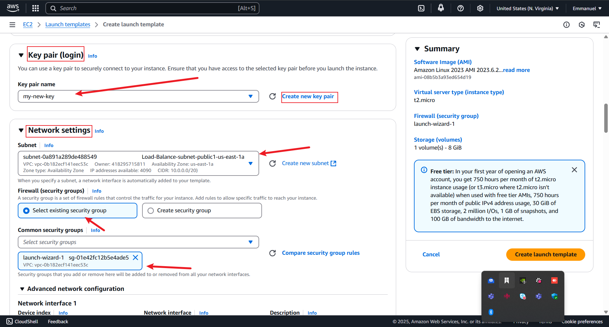

# Load Balancer and Auto-scaling in AWS
Understanding the fundamental concept of High Availability, Scalability, Load Balancer and Auto scaling Groups

    Auto Scaling Group (ASG) in AWS is a service that automatically manages a group of EC2 instances to ensure your application maintains the desired number of healthy instances. It helps with scalability, availability, and cost optimization by automatically adding or removing instances based on demand.

splitting the project into two parts:

*  part 1: Application load balancer

*  part 2: Auto Scaling Group

## PART 1: Application Load Balancer
 
 The first step is creating EC2 instance to host websites :
 
display below are the website/ip address of the instances created:

## creating a Target Group:
after creating the instances i create a target group, we have three ec2 instances in order to show how the load balance connects all of them as seen below:

as we can see all instances were registered on the Target Group

## creating the Load Balancer:
The Application load balancer is used for the load balancer since we are working on a website, the following the steps below:

after this process was concluded i went to the "Target Group" section to check the health status of the instances and saw it all the 3 instances where unhealthy
 
afterwhich i copied the public ip address"98.81.72.88" of the instance and tried to ping it from my command prompt and got a "Request time out" error which is to say the instance i was not able to connect to the instance as seen below a

Then i went to cross check the security group configuration of the instances inbound rules and made sure they allowed traffic from the Application load balancer, i also increased the health check Timeout & Reduce Threshold after which i tried to ping the ip address and was able to connect with it as seen blow:

## PART 2: AUTO SCALING GROUP(ASG)

As i said earlier the ASG helps with scalability, availability, and cost optimization by automatically adding or removing instances based on demand
 The first step is creating an "ASG", we would need to create a "launch template" during the process following the steps shown below:
 
 
 
 
 
 
 

 After successfully creating the launch template we go back to the "Auto Scraling Group" setting and finish the process as seen blow:
 
 
 
 
 

 completing the configuration of the Auto Scaling Group i went to compy the DNS "http://new-asg-1-1065400760.us-east-1.elb.amazonaws.com/" and try loading it on my web browser whereit was able to display the content of the website and when i deleted an instance the ip address did change as seen below:
 
 
 